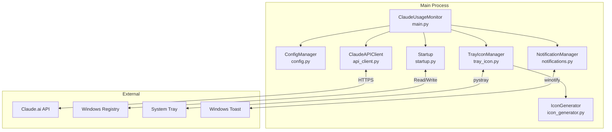
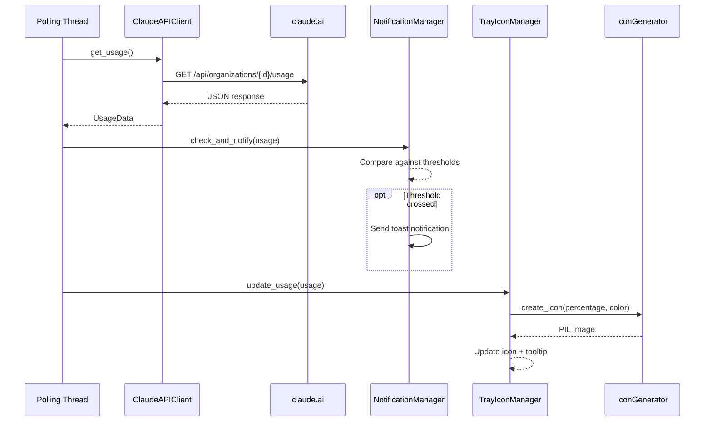
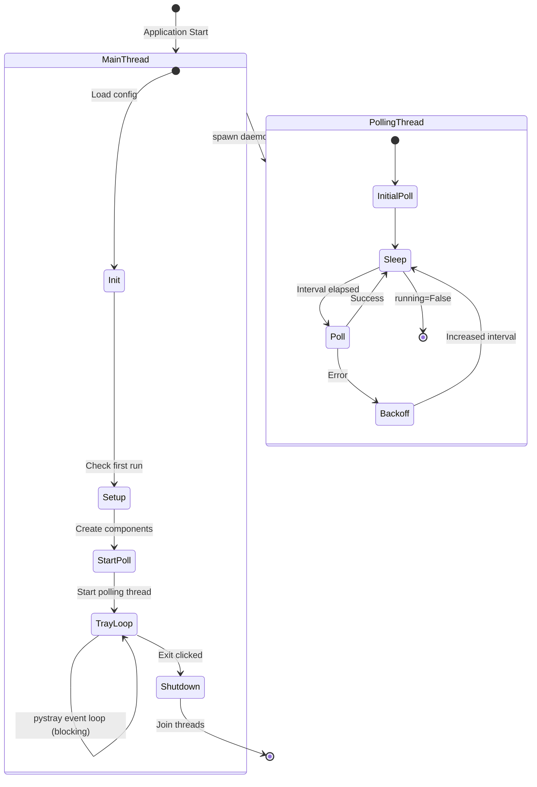
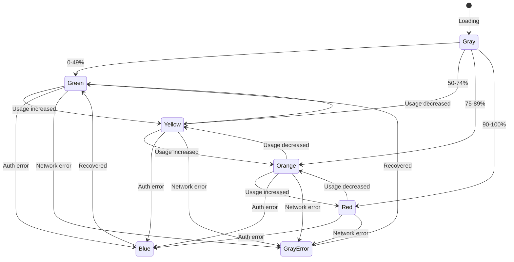

# Architecture

Technical documentation for Claudometer developers.

## Component Overview



## Data Flow



## Threading Model



## Error Handling & Retry Logic

```mermaid
flowchart TD
    POLL[Poll API] --> CHECK{Response?}

    CHECK -->|200 OK| SUCCESS[Update display]
    SUCCESS --> RESET[Reset backoff]
    RESET --> SLEEP[Sleep base interval<br/>300s default]

    CHECK -->|401/403| AUTH[AuthenticationError]
    AUTH --> AUTH_STATE[Set auth_expired state]
    AUTH_STATE --> AUTH_SLEEP[Sleep 1 hour]

    CHECK -->|429| RATE[RateLimitError]
    RATE --> RATE_STATE[Set rate_limited state]
    RATE_STATE --> RATE_SLEEP[Sleep 2 minutes]

    CHECK -->|Network Error| NET[NetworkError]
    NET --> NET_STATE[Set network_error state]
    NET_STATE --> BACKOFF[Exponential backoff]
    BACKOFF --> BACKOFF_SLEEP[Sleep min(base × 2^n, 30min)]

    SLEEP --> POLL
    AUTH_SLEEP --> POLL
    RATE_SLEEP --> POLL
    BACKOFF_SLEEP --> POLL
```

### Backoff Strategy

| Error Type | Sleep Duration | Notes |
|------------|---------------|-------|
| Success | 300s (configurable) | Base polling interval |
| Auth Error (401/403) | 3600s (1 hour) | Cookie likely expired |
| Rate Limit (429) | 120s (2 min) | Respects Retry-After header |
| Network Error | 300s → 600s → 1200s → 1800s | Exponential, max 30 min |

## API Response Structure

```
GET https://claude.ai/api/organizations/{org_id}/usage
```

```json
{
  "five_hour": {
    "utilization": 47.0,
    "resets_at": "2025-12-01T07:00:00.171939+00:00"
  },
  "seven_day": {
    "utilization": 25.0,
    "resets_at": "2025-12-02T00:00:00.171962+00:00"
  },
  "seven_day_oauth_apps": {
    "utilization": 0.0,
    "resets_at": null
  },
  "seven_day_opus": null,
  "seven_day_sonnet": {
    "utilization": 1.0,
    "resets_at": "2025-12-02T04:00:00+00:00"
  }
}
```

### Key Fields

| Field | Description |
|-------|-------------|
| `five_hour.utilization` | Current 5-hour rolling window usage (0-100%) |
| `five_hour.resets_at` | When the 5-hour window resets (ISO 8601) |
| `seven_day.utilization` | Current weekly usage (0-100%) |
| `seven_day.resets_at` | When the weekly window resets |

The tray icon displays **whichever is higher** (5-hour or weekly). Both values are shown in the tooltip.

## Icon Color States



| Color | Icon | Meaning |
|-------|------|---------|
| Green | Gauge | 0-49% usage |
| Yellow | Gauge | 50-74% usage |
| Orange | Gauge | 75-89% usage |
| Red | Gauge | 90-100% usage |
| Blue | `!` | Authentication error |
| Gray | `?` | Network/connection error |
| Gray | `...` | Loading/initializing |

## File Locations

| File | Path | Purpose |
|------|------|---------|
| Config | `%LOCALAPPDATA%\ClaudeMonitor\config.json` | User settings |
| Logs | `%LOCALAPPDATA%\ClaudeMonitor\logs\claude_monitor.log` | Application logs |
| Portable | `./config.json` (next to exe) | Optional portable mode |

Log files rotate at 5MB with 3 backups retained.

## Configuration

```json
{
  "organization_id": "uuid",
  "session_cookie": "sk-ant-...",
  "poll_interval_seconds": 300,
  "notification_thresholds": [50, 75, 90],
  "start_with_windows": false,
  "debug_mode": false
}
```

| Option | Default | Description |
|--------|---------|-------------|
| `poll_interval_seconds` | 300 | How often to check usage (5 min) |
| `notification_thresholds` | [50, 75, 90] | Usage % levels that trigger notifications |
| `start_with_windows` | false | Add to Windows startup registry |
| `debug_mode` | false | Enable verbose console logging |

---

## Development

### Prerequisites

- Python 3.11+
- Windows 10/11
- [uv](https://docs.astral.sh/uv/) package manager

### Setup

```bash
# Clone the repo
git clone https://github.com/yourusername/claudometer.git
cd claudometer

# Install dependencies
uv sync
```

### Running Locally

```bash
# Run from source
uv run python -m src.main

# Or use the installed command
uv run claudometer
```

### Building

```bash
# Build standalone exe
uv run python build.py
```

Output: `dist/ClaudeMonitor.exe` (~15MB standalone executable)

### Deploying

```bash
# Build, install, and run in one command
uv run python deploy.py
```

This will:

1. Build the exe via PyInstaller
2. Kill any running instance
3. Copy exe to `%LOCALAPPDATA%\Claudometer\`
4. Add to Windows startup registry
5. Launch the app detached

Use this for quick iteration during development.

### Testing

```bash
# Run all tests
uv run pytest tests/ -v

# Run with coverage
uv run pytest tests/ --cov=src --cov-report=html

# Run specific test file
uv run pytest tests/test_api_client.py -v
```

### Project Structure

```
claudometer/
├── src/
│   ├── __init__.py
│   ├── main.py           # Entry point, orchestration
│   ├── api_client.py     # Claude API communication
│   ├── config.py         # Configuration management
│   ├── notifications.py  # Windows toast notifications
│   ├── tray_icon.py      # System tray integration
│   ├── icon_generator.py # Dynamic icon creation
│   ├── startup.py        # Windows startup registry
│   └── utils.py          # Logging, helpers
├── tests/
│   ├── conftest.py       # Shared fixtures
│   ├── test_api_client.py
│   ├── test_config.py
│   └── test_notifications.py
├── docs/
│   └── ARCHITECTURE.md   # This file
├── build.py              # PyInstaller build script
├── build.spec            # PyInstaller configuration
├── deploy.py             # Build + install + run
├── pyproject.toml        # Project metadata
└── config.example.json   # Example configuration
```
